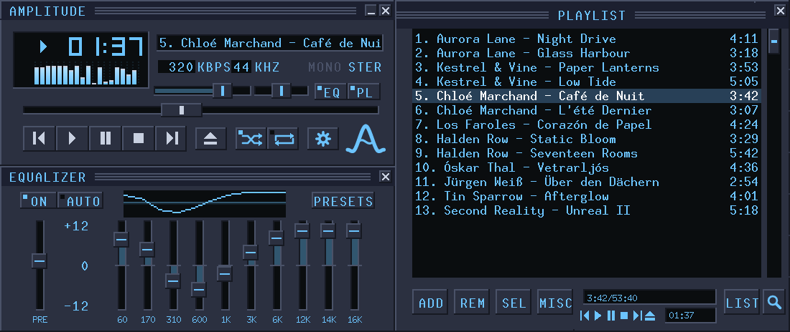

# Amplitude

A lightweight audio player for old and new computers. About a megabyte in
size, for Windows and Linux.

## Download

**[Get the latest release](https://github.com/srrudic/Amplitude/releases/latest)**
and pick the file for your system:

| System | File |
|--------|------|
| Windows, with installer | `amplitude-<version>-win32-setup.exe` (runs on every Windows) or `-win64-setup.exe` |
| Windows, no installation | `amplitude-<version>-win32.zip` or `-win64.zip`: unzip and run |
| Debian, Ubuntu, Mint | `amplitude_<version>_amd64.deb` |
| Fedora, openSUSE | `amplitude-<version>-1.x86_64.rpm` |

More about the player: https://amplitude.cr.rs

## About

Written in C99. Plays MP3, FLAC, WAV, Ogg Vorbis, Opus, AAC (M4A/MP4 and raw
ADTS) and tracker modules (MOD, XM, S3M, IT). All decoders are compiled in;
there are no runtime dependencies beyond the system's own libraries.

## Building

Everything needed is in the tree. On a Debian-based system `gcc` and `make`
are enough; the tools for the other targets are fetched into `.toolchain/`
the first time they are needed.

    make              # Linux: build/linux/amplitude
    make windows      # Windows, 32 and 64-bit: build/win32, build/win64
    make installer    # the two Windows installers
    make deb          # Debian package
    make rpm          # RPM package
    make all          # all of the above
    make dist         # the release files, collected in build/dist/
    make test         # unit tests

`docs/DEVELOPMENT.md` has the details, explains how the code is organised
and lists what is still missing. `docs/USAGE.md` covers the command line,
the keyboard and the settings file.

## Licence

Copyright © 2026 Srđan Rudić.

Amplitude is free software: you can redistribute it and/or modify it under
the terms of the GNU General Public License, version 3 or (at your option)
any later version. It is provided as is, without warranty. See `LICENSE` for the full
text.

Bundled third-party code keeps its own licence:

| Library     | Used for            | Licence                    |
|-------------|---------------------|----------------------------|
| miniaudio   | output, WAV/FLAC/MP3| public domain / MIT-0      |
| stb_vorbis  | Ogg Vorbis          | public domain / MIT        |
| libogg, libopus, opusfile | Opus  | BSD 3-clause               |
| libfaad2    | AAC                 | GPL 2 or later             |
| minimp4     | MP4 container       | CC0                        |
| libxmp-lite | tracker modules     | MIT                        |
| misc-fixed fonts | title text     | public domain              |
